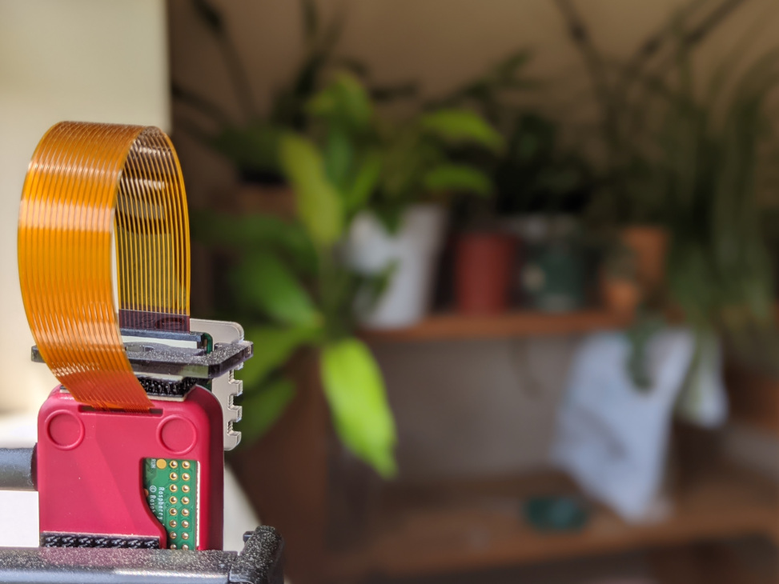

<p align="center">
 
</p>

<p align="center">
 <h1 align="center">Leafcast - pi client rust</h1>
</p>

<p align="center">
 The pi client for Leafcast, powered by <a href='https://www.staticpi.com' target='_blank' rel='noopener noreferrer'>staticPi.com</a>
</p>

<p align="center">
	Built in <a href='https://www.rust-lang.org/' target='_blank' rel='noopener noreferrer'>Rust</a>
	<br>
	<sub> See typescript branch for original, now not maintained, typescript version</sub>
</p>

<p align="center">
	See the frontend website source <a href='https://www.github.com/mrjackwills/leafcast_vue' target='_blank' rel='noopener noreferrer'>here</a>
</p>

<p align="center">
	<a href="https://raw.githubusercontent.com/mrjackwills/leafcast_vue/main/.github/pi_cam.jpg" target='_blank' rel='noopener noreferrer'>
		
	</a>
</p>

## Required Hardware

1) Raspberry pi - designed for, tested, and fully working, on a <a href='https://www.raspberrypi.com/products/raspberry-pi-zero-2-w/' target='_blank' rel='noopener noreferrer'>Raspberry pi zero w 2</a>
2) Pi camera, such as <a href='https://www.raspberrypi.com/products/camera-module-v2/' target='_blank' rel='noopener noreferrer'>camera module</a>

## Required services

1) <a href='https://www.staticpi.com/' target='_blank' rel='noopener noreferrer'>staticPi</a> - the simple and secure messaging service

## Required software

1) <a href='https://github.com/raspberrypi/libcamera-apps' target='_blank' rel='noopener noreferrer'>libcamera-still</a> - should be pre-installed in recent Pi OS version
2) <a href='https://github.com/webmproject/libwebp' target='_blank' rel='noopener noreferrer'>libwebp</a> - should be pre-installed in recent Pi OS version

## Download

See <a href="https://github.com/mrjackwills/leafcast_pi/releases" target='_blank' rel='noopener noreferrer'>releases</a>

download (aarch64 one liner)

```bash
wget https://www.github.com/mrjackwills/leafcast_pi/releases/latest/download/leafcast_linux_aarch64.tar.gz &&
tar xzvf leafcast_linux_aarch64.tar.gz leafcast
```

## Run step

a) ```sudo ./leafcast -i``` create and install systemd service file, to automatically run on boot

*or*

b) ```./leafcast``` run in current session

## Suggested directories and file

| directory | reason |
| --- | --- |
|```~/leafcast/logs```		| Log files |
|```~/leafcast/photos```	| photo storage |
|```~/leafcast/.env```		| environmental variables |
|```/ramdrive/ip.addr```	| ip address |

```bash
# addition to /etc/fstab
ramdrive /ramdrive tmpfs defaults,noatime,size=128K     0       0
```
suggested crontab

```bash
@reboot ip addr show wlan0 | grep -Po 'inet \K[\d.]+' > /ramdrive/ip.addr
*/5 * * * * ip addr show wlan0 | grep -Po 'inet \K[\d.]+' > /ramdrive/ip.addr
```
ip address gets updated every 5 minutes, so write to a ramdrive rather than causing repetitive, eventually damaging, writes to the pi's SD card


## Build step

### Raspberry pi 64bit pi (pi zero 2 w, pi 4)

requires docker & <a href='https://github.com/cross-rs/cross' target='_blank' rel='noopener noreferrer'>cross-rs</a>

1) ```cross build --target aarch64-unknown-linux-musl --release```

## Tests

Testing is a work in progress

```cargo test -- --test-threads=1```
