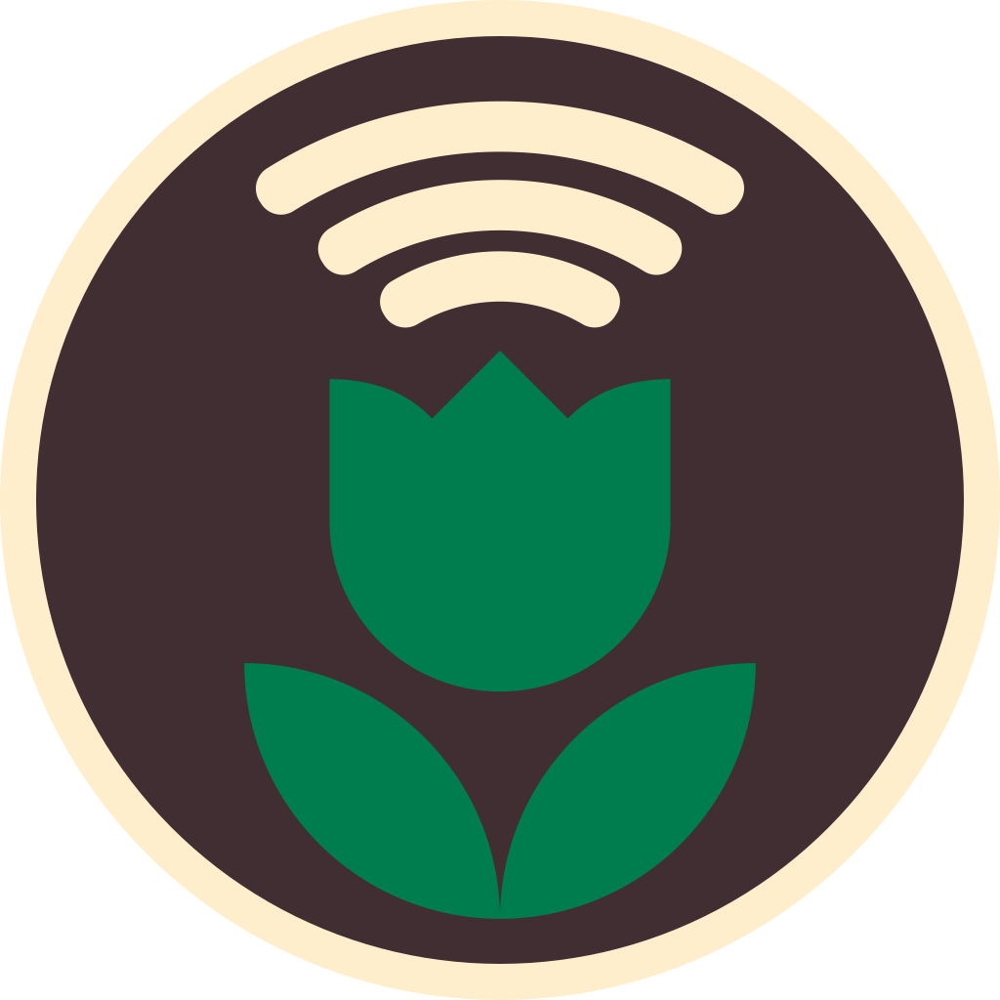

<p align="center">
 
</p>

<p align="center">
 <h1 align="center">Leafcast - pi client rust</h1>
</p>

<p align="center">
 The pi client for Leafcast, powered by <a href='https://www.staticpi.com' target='_blank' rel='noopener noreferrer'>staticPi.com</a>
</p>

<p align="center">
	Built in <a href='https://www.rust-lang.org/' target='_blank' rel='noopener noreferrer'>Rust</a>, with <a href='https://www.sqlite.org/' target='_blank' rel='noopener noreferrer'>SQLite</a>
	<br>
	<sub> See typescript branch for original, now not maintained, typescript version</sub>
</p>

<p align="center">
	See the frontend website source <a href='https://www.github.com/mrjackwills/leafcast_vue' target='_blank' rel='noopener noreferrer'>here</a>
</p>

## Required services

1) <a href='https://www.staticpi.com/' target='_blank' rel='noopener noreferrer'>staticPi</a> - the simple and secure messaging service

## Required software

1) libcamera-still

## Download

See <a href="https://github.com/mrjackwills/leafcast_pi/releases" target='_blank' rel='noopener noreferrer'>releases</a>

download (aarch64 one liner)

```bash
wget https://www.github.com/mrjackwills/leafcast_pi/releases/latest/download/leafcast_linux_aarch64.tar.gz &&
tar xzvf leafcast_linux_aarch64.tar.gz leafcast
```

## Run step

a) ```sudo ./leafcast -i``` create and install systemd service file, to automatically run on boot

*or*

b) ```./leafcast``` run in current session


## Suggested directories and file

| directory | reason |
| --- | --- |
|```~/leafcast/logs```		| Log files |
|```~/leafcast/photos```	| photo storage |
|```~/leafcast/.env```		| enviromental variables, make sure in production mode! |

## Build step for 64bit pi (pi zero 2 w, pi 4)

1) ```cross build --target aarch64-unknown-linux-musl --release```


## Tests

```cargo test -- --test-threads=1```
